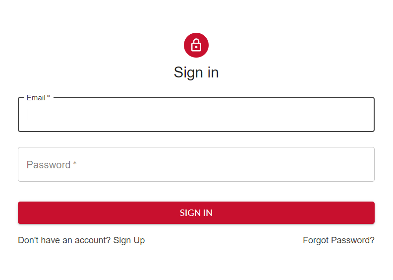
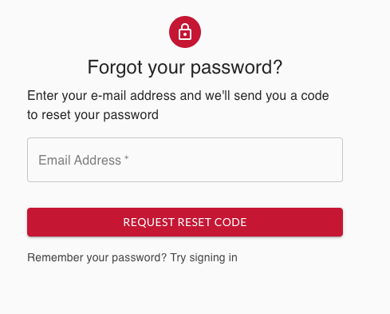
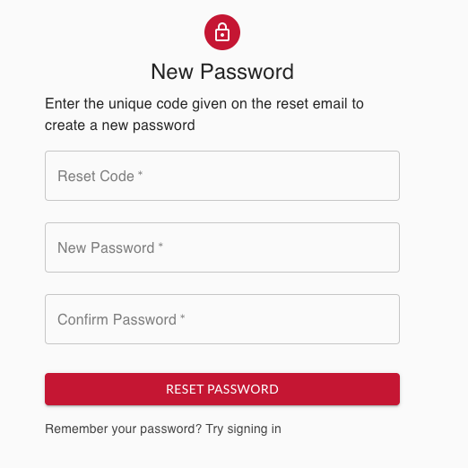

## Protected Route

### Component 

```javascript
const ProtectedRoute = ({ component: Component, ...rest }) => {...}
```

#### Methods

- [return()](https://github.com/Usman0111/profile-matching/blob/584532018a2da211d9949e2355fa57481e55f952/src/components/ProtectedRoute/ProtectedRoute.js#L5)

### Source Code

[src/components/ProtectedRoute/ProtectedRoute.js](https://github.com/Usman0111/profile-matching/blob/master/src/components/ProtectedRoute/ProtectedRoute.js)

### Main Contributors

[](https://github.com/Usman0111)
[](https://github.com/sdpa)
[](https://github.com/97morningstar)

## Not Found

### Component 

```javascript
const NotFound = () => {...}
```

#### Methods

- [return()](https://github.com/Usman0111/profile-matching/blob/584532018a2da211d9949e2355fa57481e55f952/src/pages/NotFound/NotFound.js#L16)

### Source Code

[src/pages/NotFound/NotFound.js](https://github.com/Usman0111/profile-matching/blob/master/src/pages/NotFound/NotFound.js)

### Main Contributors

[](https://github.com/Usman0111)

## Sign Up

### Component 

```javascript
export default function SignUp() {...}
```

#### Methods

- [const handleChange = (e) => {...}](https://github.com/Usman0111/profile-matching/blob/584532018a2da211d9949e2355fa57481e55f952/src/components/Signup/Signup.js#L57)

- [const signUp = (e) => {...}](https://github.com/Usman0111/profile-matching/blob/584532018a2da211d9949e2355fa57481e55f952/src/components/Signup/Signup.js#L62)

- [return()](https://github.com/Usman0111/profile-matching/blob/584532018a2da211d9949e2355fa57481e55f952/src/components/Signup/Signup.js#L94)

### Source Code

[src/components/Signup/Signup.js](https://github.com/Usman0111/profile-matching/blob/master/src/components/Signup/Signup.js)

### Main Contributors

[](https://github.com/JLopezz3)
[](https://github.com/sdpa)
[](https://github.com/Usman0111)

## Account Info

### Component 

```javascript
const AccountInfo = () => {...}
```

#### Methods

- [return()](https://github.com/Usman0111/profile-matching/blob/584532018a2da211d9949e2355fa57481e55f952/src/components/AccountInfo/AccountInfo.js#L18)

### Source Code

[src/components/AccountInfo/AccountInfo.js](https://github.com/Usman0111/profile-matching/blob/master/src/components/AccountInfo/AccountInfo.js)

### Main Contributors

[](https://github.com/97morningstar)
[](https://github.com/Usman0111)


## Company Info

### Component 

```javascript
const CompanyInfo = () => {...}
```

#### Methods

- [useEffect](https://github.com/Usman0111/profile-matching/blob/584532018a2da211d9949e2355fa57481e55f952/src/components/AccountInfo/CompanyInfo.js#L138)

- [handleChangeFirst](https://github.com/Usman0111/profile-matching/blob/584532018a2da211d9949e2355fa57481e55f952/src/components/AccountInfo/CompanyInfo.js#L155)

- [handleChangeSecond](https://github.com/Usman0111/profile-matching/blob/584532018a2da211d9949e2355fa57481e55f952/src/components/AccountInfo/CompanyInfo.js#L162)

- [checkMailingAddress](https://github.com/Usman0111/profile-matching/blob/584532018a2da211d9949e2355fa57481e55f952/src/components/AccountInfo/CompanyInfo.js#L169)

- [getAddress](https://github.com/Usman0111/profile-matching/blob/584532018a2da211d9949e2355fa57481e55f952/src/components/AccountInfo/CompanyInfo.js#L185)

- [getMailingAddress](https://github.com/Usman0111/profile-matching/blob/584532018a2da211d9949e2355fa57481e55f952/src/components/AccountInfo/CompanyInfo.js#L192)

- [nextStep](https://github.com/Usman0111/profile-matching/blob/584532018a2da211d9949e2355fa57481e55f952/src/components/AccountInfo/CompanyInfo.js#L199)

- [handleSubmit](https://github.com/Usman0111/profile-matching/blob/584532018a2da211d9949e2355fa57481e55f952/src/components/AccountInfo/CompanyInfo.js#L233)

- [return()](https://github.com/Usman0111/profile-matching/blob/584532018a2da211d9949e2355fa57481e55f952/src/components/AccountInfo/CompanyInfo.js#L321)

### React States

```javascript
const [firstStep, setFirstStep] = useState(true);

const [disable, setDisable] = useState(false);

  const [companyFirst, setCompanyFirst] = useState({
    name: "",
    industryType: "",
    companyType: "",
    address: "",
    city: "",
    state: "",
    zip: "",
    mailingAddress: "",
    city2: "",
    state2: "",
    zip2: "",
    checkedAddress: false,
    isSolo: "",
  });

  const [errorsFirst, setErrorsFirst] = useState({});
  const [errorsSecond, setErrorsSecond] = useState({});

  const [companySecond, setCompanySecond] = useState({
    companyRep: "",
    contact_email: "",
    phoneNumber: "",
    website: "",
    mission: "",
    description: "",
  });
  //api for select IndustryType
  const [industryTypes, setIndustryTypes] = useState([]);

```

### Source Code

[src/components/AccountInfo/CompanyInfo.js](https://github.com/Usman0111/profile-matching/blob/master/src/components/AccountInfo/CompanyInfo.js)

### Main Contributors

[](https://github.com/sdpa)
[](https://github.com/97morningstar)
[](https://github.com/Usman0111)


## Student Info

### Component 

```javascript
function StudentInfo() {...}
```

### React States

```javascript
const [updateFailed, setUpdateFailed] = useState(false);

const [alert, setAlert] = useState("");

  const [firstStep, setFirstStep] = useState(true);

  const [studentFirst, setStudentFirst] = useState({
    first_name: "",
    last_name: "",
    student_id: "",
    date_of_birth: "",
    graduation_date: "",
    major: "Architecture",
    degree: "Undergraduate",
    contact_email: "",
    phoneNumber: "",
    address: "",
    city: "",
    state: "",
    zipcode: "",
    username: parseInt(localStorage.getItem("email_id")),
  });
  const [errorsFirst, setErrorsFirst] = useState({});

  const [errorsSecond, setErrorsSecond] = useState({});

  const [studentSecond, setStudentSecond] = useState({
    student_description: "",
  });

  const [valueDateOfBirth, setDateOfBirth] = useState(new Date());

  const valueTodaysDate = new Date();

  const [valueGraduationDate, setGraduationDate] = useState(new Date());

  // const [image, setImage] = useState("");
  // const [resume, setResume] = useState("");
  const [skills, setSkills] = useState();

  const [tempSkill, setTempSkill] = useState("");

  const [experience, setExperience] = useState("");

  const [mySkills, setMySkills] = useState([]);
```

#### Methods

- [handleChangeFirst](https://github.com/Usman0111/profile-matching/blob/584532018a2da211d9949e2355fa57481e55f952/src/components/AccountInfo/StudentInfo.js#L232)

- [handleChangeSecond](https://github.com/Usman0111/profile-matching/blob/584532018a2da211d9949e2355fa57481e55f952/src/components/AccountInfo/StudentInfo.js#L239)

- [getSkills](https://github.com/Usman0111/profile-matching/blob/584532018a2da211d9949e2355fa57481e55f952/src/components/AccountInfo/StudentInfo.js#L255)

- [handleSubmit](https://github.com/Usman0111/profile-matching/blob/584532018a2da211d9949e2355fa57481e55f952/src/components/AccountInfo/StudentInfo.js#L264)

- [validateStudentId](https://github.com/Usman0111/profile-matching/blob/584532018a2da211d9949e2355fa57481e55f952/src/components/AccountInfo/StudentInfo.js#L278)

- [getAddress](https://github.com/Usman0111/profile-matching/blob/584532018a2da211d9949e2355fa57481e55f952/src/components/AccountInfo/StudentInfo.js#L292)

- [nextStep](https://github.com/Usman0111/profile-matching/blob/584532018a2da211d9949e2355fa57481e55f952/src/components/AccountInfo/StudentInfo.js#L299)

- [replaceSkillIdWithName](https://github.com/Usman0111/profile-matching/blob/584532018a2da211d9949e2355fa57481e55f952/src/components/AccountInfo/StudentInfo.js#L317)

- [addSkill](https://github.com/Usman0111/profile-matching/blob/584532018a2da211d9949e2355fa57481e55f952/src/components/AccountInfo/StudentInfo.js#L397)

- [handleDelete](https://github.com/Usman0111/profile-matching/blob/584532018a2da211d9949e2355fa57481e55f952/src/components/AccountInfo/StudentInfo.js#L422)

- [handleSkillChange](https://github.com/Usman0111/profile-matching/blob/584532018a2da211d9949e2355fa57481e55f952/src/components/AccountInfo/StudentInfo.js#L430)

- [handleExperienceChange](https://github.com/Usman0111/profile-matching/blob/584532018a2da211d9949e2355fa57481e55f952/src/components/AccountInfo/StudentInfo.js#L433)

- [return ()](https://github.com/Usman0111/profile-matching/blob/584532018a2da211d9949e2355fa57481e55f952/src/components/AccountInfo/StudentInfo.js#L437)

### Source Code

[src/components/AccountInfo/StudentInfo.js](https://github.com/Usman0111/profile-matching/blob/master/src/components/AccountInfo/StudentInfo.js)

### Main Contributors

[](https://github.com/sdpa)
[](https://github.com/97morningstar)
[](https://github.com/Usman0111)

## Login

The login component collects user email and password as strings and authenticates the user by sending a post request to /token endpoint. 
- If authentication is successful and the user has profile setup, the user would be redirected to the dashboard
- If authentication is successful and the user doesn’t have a profile, the user would be redirected to account info page to complete their profile
- If authentication fails, an error message is displayed



### Component 

```javascript
function Login() {...}
```

#### Methods

- [return()](https://github.com/Usman0111/profile-matching/blob/584532018a2da211d9949e2355fa57481e55f952/src/components/Login/Login.js#L108)

### Source Code

[src/components/Login/Login.js](https://github.com/Usman0111/profile-matching/blob/master/src/components/Login/Login.js)

### Main Contributors

[](https://github.com/JLopezz3)
[](https://github.com/sdpa)

## Reset Password 

The ResetPassword component can be found on the Login Page. If a user were to click on “Forgot Password?” it will route them to a ResetPassword page. 
- If a user were to remember their password, they have the option to go back to the Login page by clicking on “Remember your password? Try signing in”. 
- If a user wishes to reset their password, they will be asked to enter their email address, to which they will be sent an email which contains a reset code. 




- Validation is present, so if a user enters an email that isn’t associated with any account created on the site, they will be asked to provide a valid email.
- After a valid email is given, they will be redirected to a pass that requests the Reset Code given in the email provided, as well as a new password. 
- Reset Code must match, and both passwords must match in order for ResetPassword to be complete. 



- One ResetPassword is complete, the user will be sent back to the login page where they can now use their new password to login.

### Components

```javascript
export default function ResetPage() {...}

export default function ResetPassword({ setValidEmail }) {...}
```

### Source Code

[src/components/ResetPassword](https://github.com/Usman0111/profile-matching/tree/master/src/components/ResetPassword)

### Main Contributors

[](https://github.com/JLopezz3)

