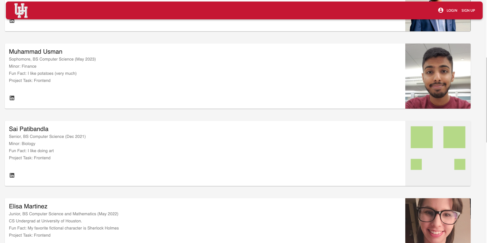
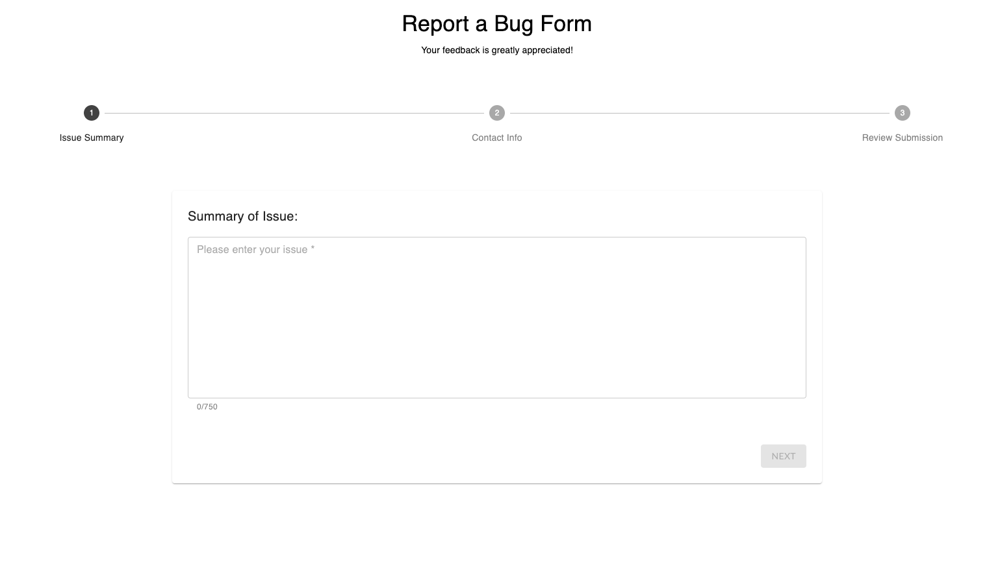
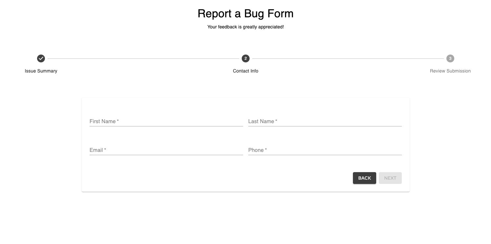
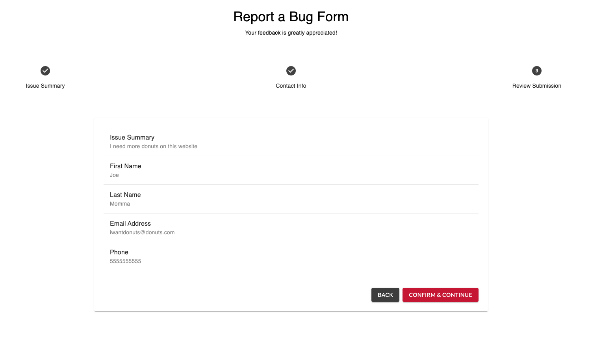
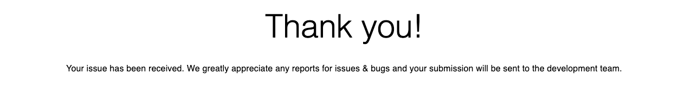

## Home Page

This page inherits navbar and footer components and renders it with a home page. This page is the first page that a user sees when they navigate to our domain. This page has navbar, home page code, and then footer. 


### Component 

```javascript
function Home() {...}
```

#### Methods

- [return()](https://github.com/Usman0111/profile-matching/blob/584532018a2da211d9949e2355fa57481e55f952/src/pages/Home/Home.js#L61)

### Source Code

[src/pages/Home/Home.js](https://github.com/Usman0111/profile-matching/blob/master/src/pages/Home/Home.js)

### Main Contributors

[](https://github.com/Usman0111)
[](https://github.com/JLopezz3)
[](https://github.com/sdpa)


## NavBar


### Component 

```javascript
export default function Navbar() {...}
```

#### Methods

- [isLoggedIn](https://github.com/Usman0111/profile-matching/blob/584532018a2da211d9949e2355fa57481e55f952/src/components/Navbar/Navbar.js#L37)

Check if token exists

```javascript
const isLoggedIn = () => {...}
```

- [return()](https://github.com/Usman0111/profile-matching/blob/584532018a2da211d9949e2355fa57481e55f952/src/components/Navbar/Navbar.js#L57)

### Source Code

[src/components/Navbar/Navbar.js](https://github.com/Usman0111/profile-matching/blob/master/src/components/Navbar/Navbar.js)

### Main Contributors

[](https://github.com/Usman0111)
[](https://github.com/JLopezz3)
[](https://github.com/sdpa)
[](https://github.com/97morningstar)

## Footer

Footer component can be seen on the Home page. It contains a University of Houston logo SVG, a link to “About the Developers”, a link to “Report an Issue” and a Copyright tag.  
- If a user clicks on “About the Developers”, it will route them to a page with details of all 8 original developers for this project. 
- If a user clicks on “Report an Issue”, it will route them to a page that allows them to leave a summary of any issues/bugs they come across throughout the entire website. 


### Component 

```javascript
export default function Footer() {...}
```

#### Methods

- [Copyright](https://github.com/Usman0111/profile-matching/blob/584532018a2da211d9949e2355fa57481e55f952/src/components/Footer/Footer.js#L7)

```javascript
function Copyright() {...}
```

- [return()](https://github.com/Usman0111/profile-matching/blob/584532018a2da211d9949e2355fa57481e55f952/src/components/Footer/Footer.js#L52)

### Source Code

[src/components/Footer/Footer.js](https://github.com/Usman0111/profile-matching/blob/master/src/components/Footer/Footer.js)

### Main Contributors

[](https://github.com/JLopezz3)

## AboutDevelopes

About the Developers component allows the user to see a page dedicated to the original 8 developers involved in this project. 
- On the page, users can see the Names, Graduation Date, Major, LinkedIn profiles etc. 
- Users can also see both Frontend and Backend developers for this project



### Component 

```javascript
export default function MediaControlCard() {...}
```

#### Methods

- [return()](https://github.com/Usman0111/profile-matching/blob/584532018a2da211d9949e2355fa57481e55f952/src/pages/AboutDevelopers/AboutDevelopers.js#L65)

### Source Code

[src/pages/AboutDevelopers/AboutDevelopers.js](https://github.com/Usman0111/profile-matching/blob/master/src/pages/AboutDevelopers/AboutDevelopers.js)

### Main Contributors

[](https://github.com/JLopezz3)


## Report Bug

Report a Bug Component allows users to report any issue/bug they may have seen or encountered anywhere throughout the website. 

- Users are first asked to give a brief summary of the issue they’d like to report. The max character limit is 750. 



- Upon completion of the issue summary, users will be sent to a page requesting for their Contact info.



- Form Validation does exist, and a user must enter an email that includes the character “ @ “ as well as a phone number in the xxx-xxx-xxxx format. 



- After the user enters their Contact Info and click Next, they can now see a review of both the issue summary and their contact info. If the user confirms, they can click “Confirm & Continue”, after which they will see a “Thank You” screen.



### Components 

#### Source Folder

[src/pages/ReportBug](https://github.com/Usman0111/profile-matching/tree/master/src/pages/ReportBug)

```javascript
// Destructuring props
const FirstStep = ({...})

// Destructuring props
const SecondStep = ({...})

export default function ReportBug() {...}

const Confirm = ({ handleNext, handleBack, values }) => {...}

const Success = () => {...}

export default function formValidation(name, value, schema) {...}

```

#### Methods

See components above

### Source Code

[src/pages/ReportBug/ContactInfoForm.js](https://github.com/Usman0111/profile-matching/blob/master/src/pages/ReportBug/ContactInfoForm.js)

[src/pages/ReportBug/IssueForm.js](https://github.com/Usman0111/profile-matching/blob/master/src/pages/ReportBug/IssueForm.js)

[src/pages/ReportBug/ReportBug.js](https://github.com/Usman0111/profile-matching/blob/master/src/pages/ReportBug/ReportBug.js)

[src/pages/ReportBug/ReviewSubmissionForm.js](https://github.com/Usman0111/profile-matching/blob/master/src/pages/ReportBug/ReviewSubmissionForm.js)

[src/pages/ReportBug/Success.js](https://github.com/Usman0111/profile-matching/blob/master/src/pages/ReportBug/Success.js)

[src/pages/ReportBug/formValidation.js](https://github.com/Usman0111/profile-matching/blob/master/src/pages/ReportBug/formValidation.js)

### Main Contributors

[](https://github.com/JLopezz3)

